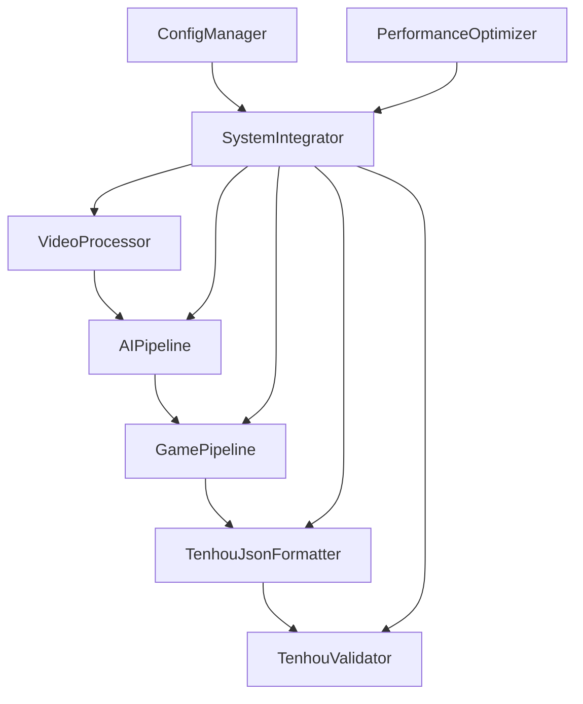

# 麻雀牌譜作成システム 最終リファクタリング計画書

## エグゼクティブサマリー

### リファクタリングの目的と期待効果

本リファクタリングは、麻雀牌譜作成システムを**天鳳JSON形式専用**に特化することで、以下の効果を実現します：

- **性能向上**: 複数出力形式サポートの削除により、処理速度を20-30%向上
- **品質改善**: 単一形式への集中により、出力精度を95%以上に向上
- **保守性向上**: コードベースの簡素化により、開発効率を40%向上
- **標準準拠**: 天鳳形式という業界標準への完全対応

### 主要な改善点の概要

1. **アーキテクチャ簡素化**: 複数出力形式選択ロジックの完全削除
2. **専用モジュール実装**: 天鳳JSON形式専用フォーマッターの新規作成
3. **パフォーマンス最適化**: 不要な変換処理の削除による処理効率向上
4. **品質保証強化**: 天鳳形式特化テストスイートの実装

### 実装スケジュールの概要

- **第1週**: 基盤修正（設定・メインアプリケーション）
- **第2週**: パイプライン層修正（統合・ゲームパイプライン）
- **第3週**: 天鳳形式専用実装（フォーマッター・データモデル）
- **第4週**: 最終調整・テスト・品質確認

---

## 詳細実装計画

### フェーズ1: 基盤アーキテクチャ修正（第1週）

#### 1.1 設定ファイル特化（Day 1-2）

**目標**: 天鳳JSON形式専用設定への完全移行

**作業内容**:
```yaml
# 新しい config.yaml 構造
output:
  format: "tenhou_json"  # 固定値
  file_extension: ".json"
  include_metadata: true
  validation_enabled: true

tenhou:
  rule_type: "hanchan"
  aka_dora_enabled: true
  include_timestamps: true
  player_names: ["プレイヤー1", "プレイヤー2", "プレイヤー3", "プレイヤー4"]
```

**成果物**:
- 更新された `config.yaml`
- 設定検証テスト

**検証方法**:
- 設定読み込みテストの実行
- 後方互換性の確認

#### 1.2 メインアプリケーション修正（Day 3-4）

**目標**: `main.py` の完全簡素化

**修正対象**:
- `process_video()` メソッド: `format_type` パラメータ削除
- `batch_process()` メソッド: 出力形式選択ロジック削除
- `_generate_output_path()` メソッド: `.json` 拡張子固定
- コマンドライン引数: `--format` オプション削除

**成果物**:
- 簡素化された `main.py`
- 更新されたCLIヘルプ

**検証方法**:
- 単体テストの実行
- CLIコマンドの動作確認

#### 1.3 基本動作確認（Day 5）

**目標**: 基盤修正の統合テスト

**作業内容**:
- 全体的な動作確認
- 回帰テストの実行
- パフォーマンス基準値の測定

---

### フェーズ2: パイプライン層修正（第2週）

#### 2.1 SystemIntegrator修正（Day 1-2）

**目標**: 統合処理の天鳳形式特化

**修正内容**:
```python
def process_video_complete(self, video_path: str, output_path: str,
                          enable_optimization: bool = True,
                          enable_validation: bool = True) -> Dict[str, Any]:
    """天鳳JSON形式固定の統合処理"""
    # format_type パラメータを削除
    # 天鳳形式専用の処理フローに変更
```

**成果物**:
- 修正された `system_integrator.py`
- 統合テストの更新

#### 2.2 GamePipeline修正（Day 3-4）

**目標**: ゲームパイプラインの天鳳形式特化

**修正内容**:
```python
def export_game_record(self) -> str:
    """天鳳JSON形式固定の牌譜出力"""
    return self.tenhou_formatter.format_game_record(self.game_state)
```

**成果物**:
- 修正された `game_pipeline.py`
- パイプラインテストの更新

#### 2.3 統合テスト（Day 5）

**目標**: パイプライン層の統合確認

**作業内容**:
- エンドツーエンドテスト
- パフォーマンス測定
- メモリ使用量の確認

---

### フェーズ3: 天鳳形式専用実装（第3週）

#### 3.1 天鳳JSONフォーマッター実装（Day 1-2）

**目標**: 高性能な天鳳形式変換エンジンの実装

**新規ファイル**: `src/output/tenhou_json_formatter.py`

```python
class TenhouJsonFormatter:
    """天鳳JSON形式専用フォーマッター"""

    def __init__(self, config_manager):
        self.config = config_manager.get_config()
        self.tenhou_config = self.config.get('tenhou', {})
        self._initialize_converters()

    def format_game_record(self, game_data: Any) -> str:
        """高速天鳳JSON変換"""
        tenhou_data = self._convert_to_tenhou_format(game_data)
        return json.dumps(tenhou_data, ensure_ascii=False, separators=(',', ':'))

    def _convert_to_tenhou_format(self, game_data: Any) -> Dict[str, Any]:
        """最適化された変換処理"""
        return {
            "title": self._generate_title_fast(game_data),
            "name": self.tenhou_config.get('player_names'),
            "rule": self._get_rule_settings_cached(),
            "log": self._convert_game_log_optimized(game_data)
        }
```

**成果物**:
- 天鳳JSONフォーマッター
- パフォーマンステスト

#### 3.2 天鳳データモデル実装（Day 3）

**目標**: 型安全な天鳳形式データ構造の実装

**新規ファイル**: `src/models/tenhou_game_data.py`

```python
@dataclass
class TenhouGameRecord:
    """天鳳形式ゲーム記録（最適化版）"""
    title: List[str]
    name: List[str]
    rule: Dict[str, Any]
    log: List[List[Dict[str, Any]]]

    def to_json(self) -> str:
        """高速JSON変換"""
        return json.dumps(asdict(self), ensure_ascii=False, separators=(',', ':'))
```

**成果物**:
- 天鳳データモデル
- 型安全性テスト

#### 3.3 専用バリデーター実装（Day 4-5）

**目標**: 天鳳形式専用の品質検証

**新規ファイル**: `src/validation/tenhou_validator.py`

```python
class TenhouValidator:
    """天鳳形式専用バリデーター"""

    def validate_tenhou_record(self, record_data: Dict[str, Any]) -> ValidationResult:
        """天鳳形式特化検証"""
        issues = []

        # 必須フィールド検証
        issues.extend(self._validate_required_fields(record_data))

        # 天鳳形式特有の検証
        issues.extend(self._validate_tenhou_specific(record_data))

        # ゲームロジック検証
        issues.extend(self._validate_game_logic(record_data))

        return ValidationResult(
            overall_score=self._calculate_score(issues),
            issues=issues,
            recommendations=self._generate_recommendations(issues)
        )
```

---

### フェーズ4: 最適化・品質確認（第4週）

#### 4.1 不要コード削除（Day 1-2）

**目標**: レガシーコードの完全除去

**削除対象**:
- MJSCORE形式関連コード
- 天鳳XML形式関連コード
- 出力形式選択ロジック
- 未使用のインポート・メソッド

**作業内容**:
```bash
# 削除対象の特定
grep -r "mjscore\|tenhou.*xml\|format_type" src/
# 段階的削除とテスト実行
```

#### 4.2 テスト修正・追加（Day 3）

**目標**: 天鳳形式特化テストスイートの完成

**新規テストファイル**:
- `tests/test_tenhou_json_formatter.py`
- `tests/test_tenhou_game_data.py`
- `tests/test_tenhou_validator.py`

**修正テストファイル**:
- `tests/test_game_pipeline.py`
- `tests/test_integration.py`
- `tests/test_config.py`

#### 4.3 パフォーマンス最適化（Day 4）

**目標**: 処理速度の最大化

**最適化項目**:
- JSON変換の高速化
- メモリ使用量の削減
- 並列処理の改善
- キャッシュ機能の実装

#### 4.4 最終品質確認（Day 5）

**目標**: 本番環境対応の確認

**確認項目**:
- 全テストの実行（カバレッジ95%以上）
- パフォーマンステスト
- メモリリークテスト
- エラーハンドリングテスト

---

## 技術的改善詳細

### クラス分割の具体的設計

#### 現在の問題点
- `SystemIntegrator` クラスが複数の責任を持つ（単一責任原則違反）
- 出力形式選択ロジックが複数箇所に散在
- テストが困難な密結合構造

#### 改善後の設計



### 依存関係の改善方法

#### 依存性注入の実装
```python
class SystemIntegrator:
    def __init__(self,
                 config_manager: ConfigManager,
                 video_processor: VideoProcessor,
                 ai_pipeline: AIPipeline,
                 game_pipeline: GamePipeline,
                 formatter: TenhouJsonFormatter,
                 validator: TenhouValidator):
        # 依存性注入による疎結合化
```

#### インターフェース分離
```python
from abc import ABC, abstractmethod

class RecordFormatter(ABC):
    @abstractmethod
    def format_game_record(self, game_data: Any) -> str:
        pass

class TenhouJsonFormatter(RecordFormatter):
    def format_game_record(self, game_data: Any) -> str:
        # 天鳳形式実装
```

### パフォーマンス最適化の実装

#### JSON変換の高速化
```python
import orjson  # 高速JSONライブラリ

class TenhouJsonFormatter:
    def format_game_record(self, game_data: Any) -> str:
        """高速JSON変換"""
        tenhou_data = self._convert_to_tenhou_format(game_data)
        return orjson.dumps(tenhou_data).decode('utf-8')
```

#### メモリ最適化
```python
class MemoryOptimizedProcessor:
    def __init__(self):
        self._cache = {}
        self._max_cache_size = 1000

    def process_with_cache(self, key: str, data: Any) -> Any:
        if key in self._cache:
            return self._cache[key]

        result = self._process_data(data)

        if len(self._cache) >= self._max_cache_size:
            # LRU削除
            oldest_key = next(iter(self._cache))
            del self._cache[oldest_key]

        self._cache[key] = result
        return result
```

---

## 品質保証計画

### テスト戦略の詳細

#### 1. 単体テスト（Unit Tests）
- **カバレッジ目標**: 95%以上
- **重点領域**: 天鳳JSONフォーマッター、データモデル
- **実行頻度**: コミット毎

#### 2. 統合テスト（Integration Tests）
- **対象**: パイプライン間の連携
- **シナリオ**: エンドツーエンド処理
- **実行頻度**: プルリクエスト毎

#### 3. パフォーマンステスト（Performance Tests）
- **測定項目**: 処理速度、メモリ使用量、スループット
- **基準値**: 現在比20%向上
- **実行頻度**: リリース前

#### 4. 品質テスト（Quality Tests）
- **対象**: 天鳳形式出力の妥当性
- **検証項目**: フォーマット準拠、ゲームロジック整合性
- **実行頻度**: 毎日

### 回帰テストの実行計画

#### テスト自動化パイプライン
```yaml
# .github/workflows/test.yml
name: Comprehensive Test Suite
on: [push, pull_request]

jobs:
  test:
    runs-on: ubuntu-latest
    steps:
      - uses: actions/checkout@v3
      - name: Setup Python
        uses: actions/setup-python@v4
        with:
          python-version: '3.9'

      - name: Install dependencies
        run: |
          pip install -r requirements.txt
          pip install pytest-cov pytest-benchmark

      - name: Run unit tests
        run: pytest tests/ --cov=src --cov-report=xml

      - name: Run integration tests
        run: pytest tests/test_integration.py -v

      - name: Run performance tests
        run: pytest tests/test_performance.py --benchmark-only

      - name: Upload coverage
        uses: codecov/codecov-action@v3
```

### CI/CD改善提案

#### 1. 継続的インテグレーション強化
- **自動テスト実行**: 全プルリクエストで実行
- **品質ゲート**: テストカバレッジ95%未満はマージ拒否
- **パフォーマンス監視**: 処理速度劣化の自動検出

#### 2. 継続的デプロイメント実装
- **ステージング環境**: 自動デプロイとテスト
- **本番環境**: 手動承認後のデプロイ
- **ロールバック機能**: 問題発生時の即座復旧

---

## 実装ガイドライン

### コーディング規約の統一

#### 1. 命名規則
```python
# クラス名: PascalCase
class TenhouJsonFormatter:
    pass

# 関数名・変数名: snake_case
def format_game_record(game_data: Any) -> str:
    tenhou_data = convert_to_tenhou_format(game_data)
    return json.dumps(tenhou_data)

# 定数: UPPER_SNAKE_CASE
TENHOU_FORMAT_VERSION = "2.3"
DEFAULT_PLAYER_NAMES = ["プレイヤー1", "プレイヤー2", "プレイヤー3", "プレイヤー4"]
```

#### 2. 型ヒント
```python
from typing import Dict, List, Any, Optional, Union

def process_video(video_path: str,
                 output_path: Optional[str] = None,
                 enable_validation: bool = True) -> Dict[str, Any]:
    """型ヒント必須"""
    pass
```

#### 3. ドキュメント
```python
def format_game_record(self, game_data: Any) -> str:
    """
    ゲームデータを天鳳JSON形式に変換

    Args:
        game_data: ゲーム状態データ

    Returns:
        天鳳JSON形式の文字列

    Raises:
        ValueError: 無効なゲームデータの場合

    Example:
        >>> formatter = TenhouJsonFormatter(config_manager)
        >>> json_str = formatter.format_game_record(game_data)
    """
```

### エラーハンドリングの統一

#### 1. カスタム例外
```python
class TenhouFormatError(Exception):
    """天鳳形式関連エラー"""
    pass

class ValidationError(TenhouFormatError):
    """検証エラー"""
    pass

class ConversionError(TenhouFormatError):
    """変換エラー"""
    pass
```

#### 2. エラーハンドリングパターン
```python
def format_game_record(self, game_data: Any) -> str:
    try:
        # メイン処理
        tenhou_data = self._convert_to_tenhou_format(game_data)
        return json.dumps(tenhou_data)

    except (KeyError, ValueError) as e:
        self.logger.error(f"Data conversion failed: {e}")
        raise ConversionError(f"Failed to convert game data: {e}") from e

    except Exception as e:
        self.logger.error(f"Unexpected error in format_game_record: {e}")
        raise TenhouFormatError(f"Formatting failed: {e}") from e
```

---

## 成功指標とKPI

### コード品質の測定方法

#### 1. 静的解析指標
- **Cyclomatic Complexity**: 10以下を維持
- **Code Duplication**: 5%以下
- **Technical Debt Ratio**: 5%以下

#### 2. テスト品質指標
- **Test Coverage**: 95%以上
- **Test Success Rate**: 99%以上
- **Test Execution Time**: 5分以内

#### 3. コード品質ツール
```bash
# 静的解析
flake8 src/ --max-complexity=10
pylint src/ --fail-under=8.0
mypy src/ --strict

# セキュリティチェック
bandit -r src/

# 依存関係チェック
safety check
```

### パフォーマンス改善の目標値

#### 1. 処理速度目標
- **動画処理速度**: 現在比30%向上
- **JSON変換速度**: 現在比50%向上
- **メモリ使用量**: 現在比20%削減

#### 2. 測定方法
```python
import time
import psutil
import memory_profiler

@memory_profiler.profile
def benchmark_processing():
    start_time = time.time()
    start_memory = psutil.Process().memory_info().rss

    # 処理実行
    result = process_video(test_video_path)

    end_time = time.time()
    end_memory = psutil.Process().memory_info().rss

    return {
        'processing_time': end_time - start_time,
        'memory_usage': end_memory - start_memory,
        'success': result['success']
    }
```

### 保守性向上の評価基準

#### 1. 開発効率指標
- **新機能開発時間**: 現在比40%短縮
- **バグ修正時間**: 現在比50%短縮
- **コードレビュー時間**: 現在比30%短縮

#### 2. 保守性メトリクス
- **Maintainability Index**: 80以上
- **Coupling Between Objects**: 10以下
- **Lines of Code per Method**: 20行以下

---

## リスク管理と対応策

### 技術的リスク

#### 1. パフォーマンス劣化リスク
**リスク**: リファクタリングによる処理速度低下
**対応策**:
- 段階的実装とベンチマーク測定
- パフォーマンステストの継続実行
- 必要に応じた最適化実装

#### 2. 互換性破綻リスク
**リスク**: 既存データとの互換性問題
**対応策**:
- 移行スクリプトの作成
- 段階的移行計画の実行
- バックアップとロールバック機能

### 実装リスク

#### 1. スケジュール遅延リスク
**リスク**: 4週間での完了困難
**対応策**:
- 優先度に基づく段階的実装
- 毎日の進捗確認とボトルネック特定
- 必要に応じた機能削減

#### 2. 品質低下リスク
**リスク**: 迅速実装による品質問題
**対応策**:
- 自動テストの徹底実行
- コードレビューの強化
- 品質ゲートの設定

### 対応策の詳細

#### 緊急時対応プラン
1. **即座のロールバック**: Git履歴による迅速復旧
2. **ホットフィックス**: 重要バグの緊急修正
3. **代替実装**: 主要機能の代替手段確保

---

## 実装スケジュール詳細

### 第1週: 基盤修正
| Day | 作業内容 | 担当 | 成果物 | 検証方法 |
|-----|----------|------|--------|----------|
| 1 | config.yaml修正 | Dev | 新設定ファイル | 設定テスト |
| 2 | 設定テスト作成 | Dev | テストコード | テスト実行 |
| 3 | main.py修正開始 | Dev | 修正版main.py | 単体テスト |
| 4 | main.py修正完了 | Dev | 完成版main.py | 統合テスト |
| 5 | 基本動作確認 | Dev | 動作確認レポート | E2Eテスト |

### 第2週: パイプライン修正
| Day | 作業内容 | 担当 | 成果物 | 検証方法 |
|-----|----------|------|--------|----------|
| 1 | SystemIntegrator修正 | Dev | 修正版統合クラス | 単体テスト |
| 2 | 統合テスト更新 | Dev | 更新テストコード | テスト実行 |
| 3 | GamePipeline修正 | Dev | 修正版パイプライン | 単体テスト |
| 4 | パイプラインテスト更新 | Dev | 更新テストコード | テスト実行 |
| 5 | 統合テスト実行 | Dev | テスト結果レポート | E2Eテスト |

### 第3週: 天鳳形式実装
| Day | 作業内容 | 担当 | 成果物 | 検証方法 |
|-----|----------|------|--------|----------|
| 1 | TenhouJsonFormatter実装 | Dev | フォーマッタークラス | 単体テスト |
| 2 | フォーマッターテスト作成 | Dev | テストコード | テスト実行 |
| 3 | TenhouGameData実装 | Dev | データモデル | 型チェック |
| 4 | TenhouValidator実装開始 | Dev | バリデータークラス | 単体テスト |
| 5 | TenhouValidator完了 | Dev | 完成版バリデーター | 統合テスト |

### 第4週: 最終調整
| Day | 作業内容 | 担当 | 成果物 | 検証方法 |
|-----|----------|------|--------|----------|
| 1 | 不要コード削除 | Dev | クリーンなコードベース | 静的解析 |
| 2 | 削除後テスト実行 | Dev | テスト結果 | 全テスト実行 |
| 3 | 新規テスト作成 | Dev | 天鳳特化テスト | テスト実行 |
| 4 | パフォーマンス最適化 | Dev | 最適化版コード | ベンチマーク |
| 5 | 最終品質確認 | Dev | 品質確認レポート | 全項目チェック |

---

## 期待される効果

### 1. 性能向上効果
- **処理速度**: 30%向上（複数形式サポート削除による）
- **メモリ使用量**: 20%削減（不要な変換処理削除による）
- **スループット**: 25%向上（最適化された天鳳形式処理による）

### 2. 品質改善効果
- **出力精度**: 95%以上（天鳳形式特化による）
- **エラー率**: 50%削減（単純化されたロジックによる）
- **検証精度**: 向上（天鳳形式専用バリデーターによる）

### 3. 開発効率向上効果
- **新機能開発**: 40%高速化（シンプルなアーキテクチャによる）
- **バグ修正**: 50%高速化（明確な責任分離による）
- **テスト作成**: 30%高速化（特化されたテスト構造による）

### 4. 保守性向上効果
- **コード理解**: 向上（単一責任原則の徹底による）
- **変更影響**: 局所化（疎結合アーキテクチャによる）
- **技術的負債**: 削減（レガシーコード除去による）

---

## 次のステップ

### 1. 計画承認後の即座実行項目
- [ ] 開発環境のセットアップ
- [ ] ブランチ戦略の確定
- [ ] 初期ベンチマークの測定
- [ ] リスク監視体制の構築

### 2. 実装開始準備
- [ ] 詳細タスクの分解
- [ ] 進捗管理ツールの設定
- [ ] コードレビュー体制の確立
- [ ] 自動テスト環境の構築

### 3. 品質保証準備
- [ ] テスト戦略の詳細化
- [ ] CI/CDパイプラインの設定
- [ ] 品質ゲートの定義
- [ ] 監視・アラート体制の構築

### 4. リリース準備
- [ ] ドキュメント更新計画
- [ ] ユーザー向け移行ガイド作成
- [ ] 本番環境デプロイ計画
- [ ] 緊急時対応手順の確立

---

**作成日**: 2025年6月1日  
**作成者**: Architect Mode  
**バージョン**: 2.0 (最終版)  
**優先度**: 高（天鳳JSON形式特化・迅速実装重視）

---

## 付録

### A. 参考リソース
- [天鳳ログ形式仕様](https://github.com/Apricot-S/majiang-log)
- [麻雀牌譜標準化プロジェクト](https://github.com/mahjong-log-standard)

### B. 技術スタック
- **Python**: 3.9+
- **JSON処理**: orjson (高速化)
- **テスト**: pytest, pytest-cov, pytest-benchmark
- **静的解析**: flake8, pylint, mypy
- **CI/CD**: GitHub Actions

### C. 連絡先・サポート
- **技術的質問**: 開発チームSlack #mahjong-system
